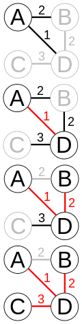

```{r setup, include=FALSE}
knitr::opts_chunk$set(echo = TRUE, warning = FALSE, message = FALSE)
```

# Introduction

## Contexte - Principe

Le Minimum Spanning Tree (MST) est un arbre couvrant de poids minimal d'un graphe connexe et pondéré. Il s'agit d'un sous-graphe acyclique qui relie tous les sommets du graphe original en minimisant la somme des poids des arêtes.

Il existe plusieurs algorithmes classiques pour trouver le MST d'un graphe, tels que l'algorithme de Kruskal et l'algorithme de Prim que nous avons choisi d'implementer ici. Ces algorithmes reposent sur des stratégies différentes pour sélectionner les arêtes à inclure dans l'arbre couvrant, mais ils garantissent tous les deux de trouver une solution optimale.

Ce package se veut notamment de résoudre efficacement des problèmes de MST sur des graphes de grande taille, spécifiques à la modélisation dans le domaine de la santé.

## Applications

Le MST a de nombreuses applications en santé, notamment dans l'analyse de données génomiques et protéomiques [étude à grande échelle des protéines]. Parmi les exemples d'applications en santé nous pouvons citer :

-   La **reconstruction de génomes** d'organismes à partir de fragments d'ADN. En utilisant un graphe dont les sommets représentent les fragments d'ADN et les arêtes représentent les chevauchements entre les fragments, le MST permet de trouver le chemin le plus court qui relie tous les fragments, ce qui correspond au génome complet de l'organisme.

-   L'**analyse de réseaux métaboliques**, en représentant par les sommets les métabolites et par les arêtes les réactions chimiques entre eux. Le MST peut être utilisé pour identifier les voies métaboliques les plus importantes dans le réseau, en sélectionnant les arêtes qui ont le poids le plus faible et donc les réactions les plus efficaces.

-   L'**analyse de données de séquençage**, où le MST est utilisé pour comparer des séquences d'ADN ou d'ARN et identifier les mutations qui les distinguent. En construisant un graphe dont les sommets représentent les séquences et les arêtes représentent les différences entre les séquences, le MST permet de trouver le chemin le plus court qui relie toutes les séquences, ce qui correspond à l'ensemble des mutations qui les séparent.

# Algorithme de Prim

## Présentation

L'**algorithme de Prim**, popularisé par Prim en 1957, est un algorithme de graphes trouvant un **arbre couvrant minimal** pour un graphe connexe pondéré non dirigé.\
Son objectif est de connecter tous les sommets du graphe avec les arêtes de poids minimal possible, sans former de cycle, pour que le poids total de l'arbre couvrant minimal soit le plus bas possible.

## Le principe

L'algorithme de Prim commence par un **sommet arbitraire** et s'étend étape par étape jusqu'à couvrir tous les sommets du graphe. À chaque étape, il ajoute l'**arête de poids minimal** **disponible** qui connecte un sommet de l'arbre en construction à un sommet en dehors de l'arbre.

## Etape de l'algorithme

1.  **Initialisation** : Sélectionner un sommet de départ arbitraire du graphe.
2.  **Sélection des Arêtes** : À partir du sommet sélectionné, choisir l'arête de poids minimal qui connecte un sommet déjà dans l'arbre à un sommet qui n'est pas encore dans l'arbre.
3.  **Ajout à l'Arbre** : Ajouter le sommet sélectionné à l'arbre, ainsi que l'arête choisie.
4.  **Répétition** : Répéter les étapes 2 et 3 jusqu'à ce que tous les sommets soient inclus dans l'arbre.

## Exemple d'application de l'algorithme



## Propriétés

-   **Greedy Algorithm** : à chaque étape, il fait le choix optimal local dans l'espoir que ce choix conduira à une solution optimale globale.

-   **Indépendant du Sommet de Départ** : peu importe le sommet de départ, l'algorithme trouve toujours le même arbre couvrant minimal. Cela montre la fiabilité de l'algorithme pour fournir un résultat consistant et optimal indépendamment de sommet initial choisi.

# Algorithme de Kruskal

# Implémentation des algorithmes en R

# Implémentation des algorithmes en Rcpp


# Simulation de données 

## Simulation de données pour n petit 

```{r, echo=FALSE}
library(igraph)
library(mstPackage)

n <- 5
adj_matrix <- generate_random_adjacency_matrix(n)
p = prim_mst(adj_matrix)
k = kruskal_mst(adj_matrix)
pc = prim_mst_rcpp(adj_matrix)
kc = kruskal_mst_rcpp(adj_matrix)

convert_inf_to_zero <- function(matrix) {
  matrix[is.infinite(matrix)] <- 0
  return(matrix)
}

adj_matrix <- convert_inf_to_zero(adj_matrix)
p <- convert_inf_to_zero(p)
k <- convert_inf_to_zero(k)
pc <- convert_inf_to_zero(pc)
kc <- convert_inf_to_zero(kc)

par(mfrow=c(1, 5), mar=c(4, 4, 2, 1), cex=0.4)

plot(graph_from_adjacency_matrix(adj_matrix, mode = "undirected", diag = FALSE), main="Graphe Initial")
plot(graph_from_adjacency_matrix(p, mode = "undirected", diag = FALSE), main="Prim MST")
plot(graph_from_adjacency_matrix(k, mode = "undirected", diag = FALSE), main="Kruskal MST")
plot(graph_from_adjacency_matrix(pc, mode = "undirected", diag = FALSE), main="Prim MST (Rcpp)")
plot(graph_from_adjacency_matrix(kc, mode = "undirected", diag = FALSE), main="Kruskal MST (Rcpp)")
```


## simulation pour n grand 

```{r, echo = FALSE}
library(igraph)

n <- 100
adj_matrix <- generate_random_adjacency_matrix(n)
p = prim_mst(adj_matrix)
k = kruskal_mst(adj_matrix)
pc = prim_mst_rcpp(adj_matrix)
kc = kruskal_mst_rcpp(adj_matrix)

convert_inf_to_zero <- function(matrix) {
  matrix[is.infinite(matrix)] <- 0
  return(matrix)
}

adj_matrix <- convert_inf_to_zero(adj_matrix)
p <- convert_inf_to_zero(p)
k <- convert_inf_to_zero(k)
pc <- convert_inf_to_zero(pc)
kc <- convert_inf_to_zero(kc)

par(mfrow=c(1, 5), mar=c(4, 4, 2, 1), cex=0.4)

plot(graph_from_adjacency_matrix(adj_matrix, mode = "undirected", diag = FALSE), main="Graphe Initial")
plot(graph_from_adjacency_matrix(p, mode = "undirected", diag = FALSE), main="Prim MST")
plot(graph_from_adjacency_matrix(k, mode = "undirected", diag = FALSE), main="Kruskal MST")
plot(graph_from_adjacency_matrix(pc, mode = "undirected", diag = FALSE), main="Prim MST (Rcpp)")
plot(graph_from_adjacency_matrix(kc, mode = "undirected", diag = FALSE), main="Kruskal MST (Rcpp)")
```

# Comparaison des complexités temporelles

Fonction qui calcule le temps

```{r, echo=FALSE}
library(mstPackage)

one.simu <- function(func = "prim_mst", adj_matrix = NULL) {
  start_time <- NA
  end_time <- NA

  if (func == "prim_mst") {
    start_time <- Sys.time()
    mst <- prim_mst(adj_matrix)
    end_time <- Sys.time()

  } else if (func == "kruskal_mst") {
    start_time <- Sys.time()
    mst <- kruskal_mst(adj_matrix)
    end_time <- Sys.time()
  }
  else if (func == "kruskal_mst_rcpp") {
    start_time <- Sys.time()
    mst <- kruskal_mst_rcpp(adj_matrix)
    end_time <- Sys.time()
  }
  else if (func == "prim_mst_rcpp") {
    start_time <- Sys.time()
    mst <- prim_mst_rcpp(adj_matrix)
    end_time <- Sys.time()
  }

  return(unclass(end_time - start_time)[1])
}
```


## Analyse meilleurs / pires des cas

### meilleur : sur ACM

```{r, echo=FALSE}
library(igraph)

meilleur_acm <- matrix(
  c(Inf, 1,   Inf, Inf,
    1,   Inf, 1,   Inf,
    Inf, 1,   Inf, 1,
    Inf, Inf, 1,   Inf),
  nrow = 4, byrow = TRUE
)
meilleur_acm_aff = meilleur_acm
meilleur_acm_aff[is.infinite(meilleur_acm)] <- 0
g <- graph_from_adjacency_matrix(meilleur_acm_aff, mode = "undirected", weighted = TRUE, diag = FALSE)
plot(g, main="Graphe ACM", edge.label=E(g)$weight)
```

```{r, echo = FALSE}
results <- c(
  d = one.simu(func = "prim_mst", meilleur_acm),
  a = one.simu(func = "kruskal_mst", meilleur_acm),
  b = one.simu(func = "prim_mst_rcpp", meilleur_acm),
  c = one.simu(func = "kruskal_mst_rcpp", meilleur_acm)
)

df_results <- data.frame(
  Algorithm = c("Prim MST", "Kruskal MST", "Prim MST (Rcpp)", "Kruskal MST (Rcpp)"),
  ExecutionTime = unname(results) 
)
print(df_results)
```


### pire cas : entièrement connexe + arête pas ordonnée 

```{r, echo = FALSE}
pire_cas_prim <- matrix(
  c(Inf, 10, 9, 8,
    10, Inf, 6, 5,
    9, 6, Inf, 4,
     8, 5, 4, Inf),
  nrow = 4, byrow = TRUE
)

pire_cas_prim_af = pire_cas_prim
pire_cas_prim_af[is.infinite(pire_cas_prim)] <- 0
g2 <- graph_from_adjacency_matrix(pire_cas_prim_af, mode = "undirected", weighted = TRUE, diag = FALSE)
plot(g2, main="Graphe du pire des cas", edge.label=E(g2)$weight)
```

```{r, echo = FALSE}
results <- c(
  d = one.simu(func = "prim_mst", pire_cas_prim),
  a = one.simu(func = "kruskal_mst", pire_cas_prim),
  b = one.simu(func = "prim_mst_rcpp", pire_cas_prim),
  c = one.simu(func = "kruskal_mst_rcpp", pire_cas_prim)
)

df_results2 <- data.frame(
  Algorithm = c("Prim MST", "Kruskal MST", "Prim MST (Rcpp)", "Kruskal MST (Rcpp)"),
  ExecutionTime = unname(results) 
)
print(df_results2)
```


## Analyse de différents cas particuliers


### Graphe disjoint


```{r, echo = FALSE}
disjoint_graph <- matrix(Inf, nrow=6, ncol=6)
disjoint_graph[1:3, 1:3] <- 1 
diag(disjoint_graph) <- Inf 

results <- c(
  d = one.simu(func = "prim_mst", disjoint_graph),
  a = one.simu(func = "kruskal_mst", disjoint_graph),
  b = one.simu(func = "prim_mst_rcpp", disjoint_graph),
  c = one.simu(func = "kruskal_mst_rcpp", disjoint_graph)
)

df_results3 <- data.frame(
  Algorithm = c("Prim MST", "Kruskal MST", "Prim MST (Rcpp)", "Kruskal MST (Rcpp)"),
  ExecutionTime = unname(results) 
)
print(df_results3)
```

Erreur -\> remplacer par warning


### Graphe cycle complet

```{r, echo = FALSE}
complete_cycle_graph <- matrix(2, nrow=5, ncol=5)
diag(complete_cycle_graph) <- Inf

results <- c(
  d = one.simu(func = "prim_mst", complete_cycle_graph),
  a = one.simu(func = "kruskal_mst", complete_cycle_graph),
  b = one.simu(func = "prim_mst_rcpp", complete_cycle_graph),
  c = one.simu(func = "kruskal_mst_rcpp", complete_cycle_graph)
)

df_results4 <- data.frame(
  Algorithm = c("Prim MST", "Kruskal MST", "Prim MST (Rcpp)", "Kruskal MST (Rcpp)"),
  ExecutionTime = unname(results) 
)
print(df_results4)
```

### Graphe étoile

avec un noeud central
-> trouver une application 
```{r, echo = FALSE}

star_graph <- matrix(Inf, nrow=5, ncol=5)
star_graph[1, 2:5] <- 1
star_graph[2:5, 1] <- 1
diag(star_graph) <- Inf 


results <- c(
  d = one.simu(func = "prim_mst", star_graph),
  a = one.simu(func = "kruskal_mst", star_graph),
  b = one.simu(func = "prim_mst_rcpp", star_graph),
  c = one.simu(func = "kruskal_mst_rcpp", star_graph)
)

df_results5 <- data.frame(
  Algorithm = c("Prim MST", "Kruskal MST", "Prim MST (Rcpp)", "Kruskal MST (Rcpp)"),
  ExecutionTime = unname(results) 
)
print(df_results5)
```

### Graphe linéaire / chainé

```{r}
linear_graph <- matrix(Inf, nrow=5, ncol=5)
linear_graph[row(linear_graph) == col(linear_graph) + 1] <- 1
linear_graph[row(linear_graph) + 1 == col(linear_graph)] <- 1

results <- c(
  d = one.simu(func = "prim_mst", linear_graph),
  a = one.simu(func = "kruskal_mst", linear_graph),
  b = one.simu(func = "prim_mst_rcpp", linear_graph),
  c = one.simu(func = "kruskal_mst_rcpp", linear_graph)
)

df_results6 <- data.frame(
  Algorithm = c("Prim MST", "Kruskal MST", "Prim MST (Rcpp)", "Kruskal MST (Rcpp)"),
  ExecutionTime = unname(results) 
)
print(df_results6)
```

### Graphes à Multiples Égalités de Poids Minimal

```{r}

multiple_min_weights_graph <- matrix(sample(c(rep(1, 5), 2:10), 25, replace = TRUE), nrow=5)
multiple_min_weights_graph <- (multiple_min_weights_graph + t(multiple_min_weights_graph)) / 2
diag(multiple_min_weights_graph) <- Inf 

results <- c(
  d = one.simu(func = "prim_mst", multiple_min_weights_graph),
  a = one.simu(func = "kruskal_mst", multiple_min_weights_graph),
  b = one.simu(func = "prim_mst_rcpp", multiple_min_weights_graph),
  c = one.simu(func = "kruskal_mst_rcpp", multiple_min_weights_graph)
)

df_results7 <- data.frame(
  Algorithm = c("Prim MST", "Kruskal MST", "Prim MST (Rcpp)", "Kruskal MST (Rcpp)"),
  ExecutionTime = unname(results) 
)
print(df_results7)
```

### Graphes avec Boucles

```{r}
graph_with_loops <- matrix(sample(1:10, 25, replace = TRUE), nrow=5)
graph_with_loops <- (graph_with_loops + t(graph_with_loops)) / 2

results <- c(
  d = one.simu(func = "prim_mst", graph_with_loops),
  a = one.simu(func = "kruskal_mst", graph_with_loops),
  b = one.simu(func = "prim_mst_rcpp", graph_with_loops),
  c = one.simu(func = "kruskal_mst_rcpp", graph_with_loops)
)

df_results8 <- data.frame(
  Algorithm = c("Prim MST", "Kruskal MST", "Prim MST (Rcpp)", "Kruskal MST (Rcpp)"),
  ExecutionTime = unname(results) 
)
print(df_results8)
```

### Graphes avec Poids Négatifs

```{r}
negative_weights_graph <- matrix(sample(-10:10, 25, replace = TRUE), nrow=5)
negative_weights_graph <- (negative_weights_graph + t(negative_weights_graph)) / 2
diag(negative_weights_graph) <- Inf 


results <- c(
  d = one.simu(func = "prim_mst", negative_weights_graph),
  a = one.simu(func = "kruskal_mst", negative_weights_graph),
  b = one.simu(func = "prim_mst_rcpp", negative_weights_graph),
  c = one.simu(func = "kruskal_mst_rcpp", negative_weights_graph)
)

df_results9 <- data.frame(
  Algorithm = c("Prim MST", "Kruskal MST", "Prim MST (Rcpp)", "Kruskal MST (Rcpp)"),
  ExecutionTime = unname(results) 
)
print(df_results9)
```

### Graphe très dense 

```{r}

set.seed(42) # Pour la reproductibilité
graph_dense <- matrix(sample(1:10, 25, replace = TRUE), nrow=5)
graph_dense <- (graph_dense + t(graph_dense)) / 2

results <- c(
  prim_mst = one.simu(func = "prim_mst", graph_dense),
  kruskal_mst = one.simu(func = "kruskal_mst", graph_dense),
  prim_mst_rcpp = one.simu(func = "prim_mst_rcpp", graph_dense),
  kruskal_mst_rcpp = one.simu(func = "kruskal_mst_rcpp", graph_dense)
)

df_results_dense <- data.frame(
  Algorithm = c("Prim MST", "Kruskal MST", "Prim MST (Rcpp)", "Kruskal MST (Rcpp)"),
  ExecutionTime = unname(results)
)

print(df_results_dense)
```


## Analyse diverses tailles de graphe à densité fixée

```{r}
library(tidyr) 
library(ggplot2)
library(mstPackage) 

sizes <- seq(5, 100, by = 10) 
density <- 0.5 

size_results <- matrix(NA, length(sizes), 4)
colnames(size_results) <- c("prim_mst", "kruskal_mst", "prim_mst_rcpp", "kruskal_mst_rcpp")

for (i in 1:length(sizes)) {
  adj_matrix <- generate_random_adjacency_matrix(sizes[i], num_zeros = round((1 - density) * sizes[i] * (sizes[i] - 1) / 2))
  
  for (func in colnames(size_results)) {
    size_results[i, func] <- one.simu(func, adj_matrix)
  }
}

size_df <- as.data.frame(size_results)
size_df$size <- sizes

size_long <- pivot_longer(size_df, cols = c("prim_mst", "kruskal_mst", "prim_mst_rcpp", "kruskal_mst_rcpp"),
                          names_to = "Algorithm", values_to = "Time")

ggplot(size_long, aes(x = size, y = Time, color = Algorithm)) +
  geom_line() + geom_point() +
  scale_x_log10(name = "Size of Graph (Log Scale)") +
  scale_y_log10(name = "Time (Log Scale)") +
  ggtitle("Impact of graph size on the runtime (Log Scale)") +
  theme_minimal()

size_long$LogSize <- log(size_long$size)
size_long$LogTime <- log(size_long$Time)

```

On peut récupérer les pentes 

```{r, echo = FALSE}

slopes_list <- list()

for(algo in unique(size_long$Algorithm)) {
  model <- lm(LogTime ~ LogSize, data = size_long, subset = Algorithm == algo)
  slope <- coef(model)[["LogSize"]]  # Extract the slope coefficient
  slopes_list[[algo]] <- slope
}
slopes_df <- data.frame(Algorithm = names(slopes_list), Slope = unlist(slopes_list), stringsAsFactors = FALSE)
print(slopes_df)

```

#### Analyse diverses poids de graphe à densité et taille fixées

```{r}
library(tidyr) 
library(ggplot2)
library(mstPackage)

n <- 100 # Taille du graphe fixe
density <- 0.5 # Densité constante

# plages de poids à tester
weight_ranges <- list(c(1,10), c(1,20), c(1,50), c(1,100), c(1,200), c(1,500), c(1,1000))

weight_data <- data.frame(Size = integer(),
                          Algorithm = character(),
                          Time = numeric(),
                          LogTime = numeric(),
                          WeightRange = character())

for (range in weight_ranges) {
  print(paste("Testing weight range:", range[1], "-", range[2]))
  adj_matrix <- generate_random_adjacency_matrix(n, num_zeros = round((1 - density) * n * (n - 1) / 2))
  adj_matrix[adj_matrix != Inf] <- sample(range[1]:range[2], sum(adj_matrix != Inf), replace = TRUE)
  
  for (algo in c("prim_mst", "kruskal_mst", "prim_mst_rcpp", "kruskal_mst_rcpp")) {
    time_taken <- one.simu(algo, adj_matrix)
    weight_data <- rbind(weight_data, data.frame(Size = n,
                                                 Algorithm = algo,
                                                 Time = time_taken,
                                                 LogTime = log(time_taken),
                                                 WeightRange = paste(range, collapse = "-")))
  }
}

ggplot(weight_data, aes(x = WeightRange, y = LogTime, group = Algorithm, color = Algorithm)) +
  geom_line() +
  geom_point() +
  theme_minimal() +
  scale_y_continuous(name = "Log(Time)") +
  scale_x_discrete(name = "Weight Range") +
  ggtitle("Impact des Plages de Poids sur le Temps d'Exécution (Log Scale)")
```


## Calcul des gains 

```{r, echo = FALSE}
set.seed(42)
nbSimus <- 50
adj_matrix <- generate_random_adjacency_matrix(100)
time1 <- 0
time2 <- 0
time3 <- 0
time4 <- 0

# Calculer le temps total pour chaque algorithme
for(i in 1:nbSimus){time1 <- time1 + one.simu(func = "prim_mst", adj_matrix)}
for(i in 1:nbSimus){time2 <- time2 + one.simu(func = "kruskal_mst", adj_matrix)}
for(i in 1:nbSimus){time3 <- time3 + one.simu(func = "prim_mst_rcpp", adj_matrix)}
for(i in 1:nbSimus){time4 <- time4 + one.simu(func = "kruskal_mst_rcpp", adj_matrix)}

mean_time1 <- time1 / nbSimus
mean_time2 <- time2 / nbSimus
mean_time3 <- time3 / nbSimus
mean_time4 <- time4 / nbSimus

df_results10 <- data.frame(
  Algorithm = c("Prim MST", "Kruskal MST", "Prim MST (Rcpp)", "Kruskal MST (Rcpp)"),
  AverageExecutionTime = c(mean_time1, mean_time2, mean_time3, mean_time4)
)

print(df_results10)
```
On peut calculer gain en performance 

```{r, echo = FALSE}
gain_R_to_Rcpp_prim <- time1 / time3
gain_R_to_Rcpp_kruskal <- time2 / time4

gain_prim_to_kruskal_R <- time1 / time2
gain_prim_to_kruskal_Rcpp <- time3 / time4

df_performance_gain <- data.frame(
  Comparison = c("R to Rcpp (Prim)", "R to Rcpp (Kruskal)", "Prim to Kruskal (R)", "Prim to Kruskal (Rcpp)"),
  Gain = c(gain_R_to_Rcpp_prim, gain_R_to_Rcpp_kruskal, gain_prim_to_kruskal_R, gain_prim_to_kruskal_Rcpp)
)

print(df_performance_gain)

```

## Microbenchmark

```{r, echo = FALSE}
library(microbenchmark)

adj_matrix <- generate_random_adjacency_matrix(100)

res3 <- microbenchmark(one.simu(func = "prim_mst_rcpp", adj_matrix), one.simu(func = "kruskal_mst_rcpp", adj_matrix), one.simu(func = "prim_mst", adj_matrix), one.simu(func = "kruskal_mst", adj_matrix), times = 50)
autoplot(res3)
res3
```

## Références
